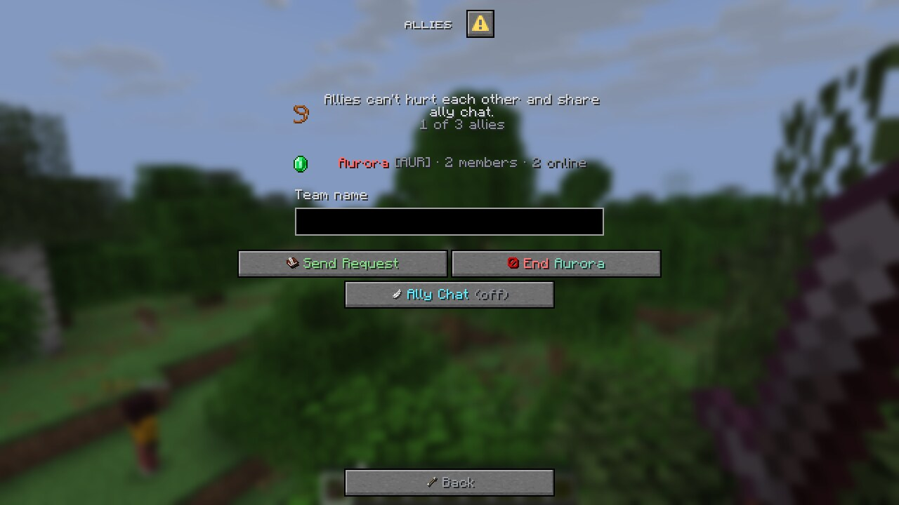
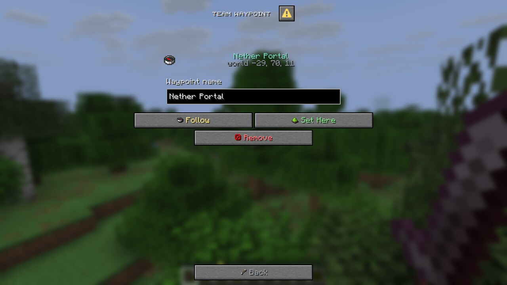
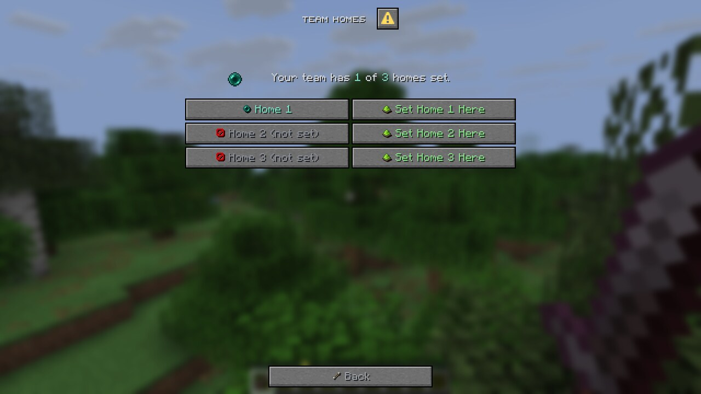
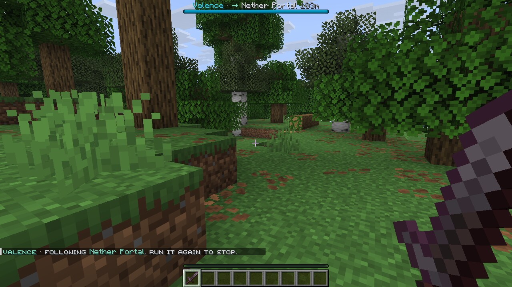
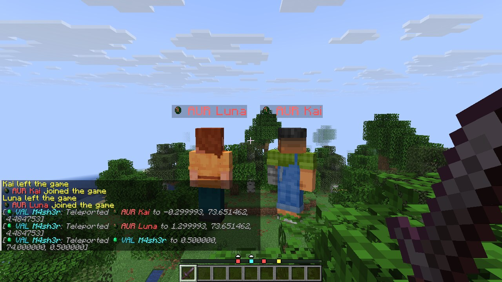
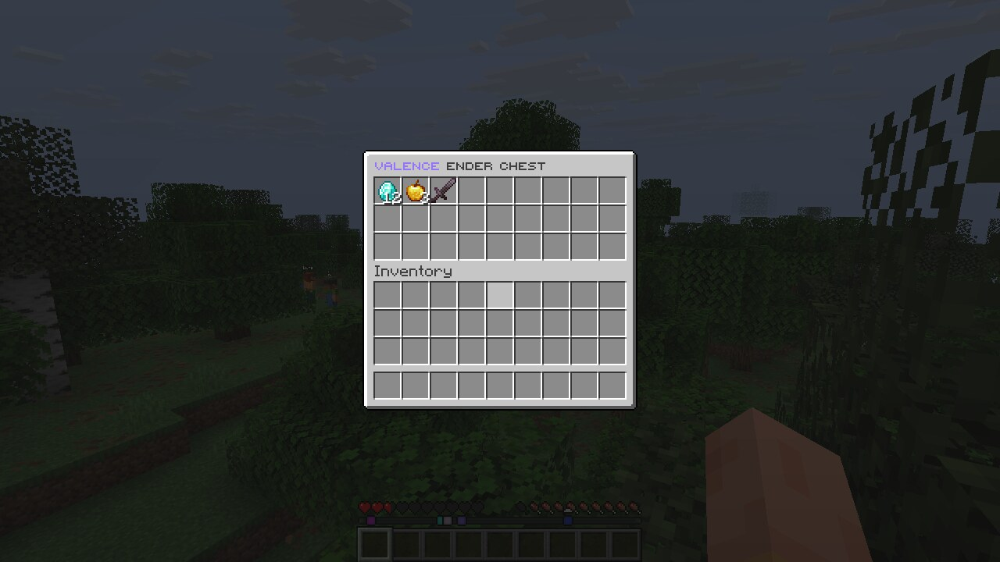

# Valence

A clean team and party plugin built on Minecraft's dialog screens. Made by **M4sh3r**.

Players type `/team` and get a real menu: no chest GUIs and no wall of chat. Every button has its own color and a small item icon, titles are in small caps, and nothing is bold.


## Supported servers

| Server | Versions | Menus |
| --- | --- | --- |
| Paper | 1.21.7 – 26.3 | Dialog menus |
| Folia | 1.21.8 – 26.2 | Dialog menus |
| Paper / Folia | 1.21 – 1.21.6 | Chat menus (these versions have no dialog screens) |

On 1.21 – 1.21.6, every feature still works through commands and clickable chat. The small item icons inside buttons need 1.21.9 or newer; on 1.21.7 – 1.21.8 the buttons show text only.

**Optional:** [Vault](https://github.com/MilkBowl/Vault) (or [VaultUnlocked](https://modrinth.com/plugin/vaultunlocked) on Folia) with any economy plugin for the team bank, and [PlaceholderAPI](https://placeholderapi.com).

## Performance

Menus are built off the main thread, and so are most commands, the join message and team chat. Balances and playtime are cached, and team files save in the background. Only money changes and teleports run on the server thread.

In a 95 second stress test, 10 players opened 4,516 menus (about 48 per second) while also using team chat and commands. A profiler caught Valence on the main thread once in 535 samples, which works out to roughly 0.01% under that load. Normal play is far lighter.

## Features

- **Team creation in a form.** Name, tag, color and icon, all picked in one dialog. You can also use `/team create <name> [tag]`.
- **Main page.** Shows the team icon, level, member count and bank, plus a search bar that finds any member of your team.
- **Members list.** Click anyone to open their profile: their head icon, rank, balance, playtime, join date, kills, deaths and how much they have deposited.
- **Member management.** Promote, demote, set rank, send a private message, kick, or make someone the owner. The buttons only show what your rank is allowed to do.
- **Custom ranks.** The owner can make up to 10 ranks. Each rank has a name, an icon, a position in the ranking table and its own permissions (invite, kick, promote and demote, deposit, level up, set home, use home, edit settings, ender chest, manage allies, set waypoint). Ranks can also be managed with `/team rank`..
- **Team bank.** Anyone with permission can deposit. Only the owner can withdraw or give money to a player. Amounts like `5k`, `2.5m` and `1,000` all work.
- **Team levels with perks.** Spend bank money to level up. Each level in `config.yml` sets the member limit, ender chest rows (1 to 6), how many team homes the team gets, and an optional buff (like Haste) that members get while standing near a teammate.
- **Bank interest and weekly rewards.** The team bank earns a small daily interest (1% by default, capped). Every week the top teams on the leaderboard win a prize paid into their bank.
- **Team Top.** A leaderboard of the richest teams.
- **Top Players.** The leaderboard inside your own team: most kills, richest members and top contributors.
- **Team homes.** Up to 5 homes per team, unlocked by level. They have a warmup that cancels if you move, plus a cooldown.
- **Team chat.** Toggle it with `/team chat`, or send one message with `/tc <message>`.
- **Allies.** Teams can ally each other (3 allies by default). Allies can't hurt each other and share an ally chat (`/ac`). Requests have to be accepted by the other team.
- **Team waypoint.** A shared marker. Teammates who follow it get a bar at the top of the screen with an arrow and the distance, so nobody needs to teleport.
- **Invites.** Invites pop up as a dialog with Accept and Deny buttons, plus clickable chat buttons, and they expire.
- **Open teams.** Teams can let anyone join. Players without a team can browse them.
- **Activity log.** Joins, leaves, kicks, promotions, deposits and settings changes.
- **Team ender chest.** One shared chest per team (`/team chest` or the Ender Chest button). When a team is disbanded, its items go to the owner, or to whoever has the chest open.
  - **Dupe protection:** every change saves the chest and the player's inventory together, so even after a crash both come back from the same moment. Tested by hard-killing the server right after moving items in and right after taking them out: nothing doubled either way.
  - **One player at a time on Folia:** the chest is locked to one player before it opens, so two region threads never touch it at once.
  - **Disband while open:** the items go to whoever has the chest open, never to a deleted team.
  - **Old saves:** a slow background save can't overwrite a newer one, and a deleted team's file never comes back.
- **Personal friendly fire.** Teammates can't hurt each other. Each player can turn friendly fire on for themselves (`/team ff` or the menu button), and two teammates can only fight when both have it on. Covers melee, arrows, tamed pets and harmful splash potions.
- **Team prefix.** Shows the team's item icon and tag (like VAL) in its color before player names in chat, in the tab list and above their heads. The format is set in `config.yml`, and each place can be turned off. Folia doesn't allow the scoreboard teams this uses, so on Folia it shows in chat and the tab list only.
- **MySQL for networks.** Set `storage.type: mysql` and every server on a BungeeCord or Velocity network shares the same teams. Changes reach the other servers within a few seconds, a team's ender chest can only be open on one server at a time, and items owed to an offline owner wait in the database for whichever server they join next.
- **Full chat menus on 1.21 to 1.21.6.** Every page has a clickable chat version for servers without dialog screens.
- **Small caps chat.** Every chat reply looks like ᴛʜɪꜱ. Commands and player names keep the normal font.

## Commands

| Command | What it does |
| --- | --- |
| `/team` | Open the team menu |
| `/team create <name> [tag]` | Create a team |
| `/team invite <player>` | Invite a player |
| `/team accept [team]` / `/team deny [team]` | Answer an invite |
| `/team join <team>` | Join an open team |
| `/team leave` | Leave your team |
| `/team disband confirm` | Delete your team (owner) |
| `/team kick / promote / demote <player>` | Manage members |
| `/team setrank <player> <rank>` | Set a member's rank |
| `/team transfer <player>` | Give the team to someone else |
| `/team members` / `bank` / `top` | Open a page directly |
| `/team info [team]` | Team info in chat |
| `/team deposit <amount>` / `withdraw <amount>` | Use the bank |
| `/team give <player> <amount>` | Pay someone from the bank (owner) |
| `/team upgrade` | Level up the team |
| `/team chat [message]` / `/tc [message]` | Team chat |
| `/team chest` | Open the team ender chest |
| `/team home [number]` / `sethome [number]` / `delhome [number]` | Team homes |
| `/team ally <team>` / `ally accept <team>` / `ally remove <team>` / `allies` | Allies |
| `/allychat [message]` / `/ac [message]` | Ally chat |
| `/team waypoint` / `waypoint set <name>` / `waypoint clear` | Follow or set the team waypoint |
| `/team profile [player]` / `players` / `log` / `ranks` | Info pages in chat |
| `/team rank create\|delete\|perm\|icon\|position\|rename ...` | Manage ranks by command |
| `/team set name\|tag\|color\|icon\|open <value>` | Change team settings by command |
| `/team ff` | Turn friendly fire on or off for yourself |
| `/team reload` | Reload config and messages (admin) |
| `/team admin disband <team>` | Delete any team (admin) |
| `/team admin setlevel <team> <level>` / `setbank <team> <amount>` | Change a team's level or bank (admin) |

Aliases: `/teams`, `/party`, `/t`.

## Permissions

| Permission | Default |
| --- | --- |
| `valence.use` | everyone |
| `valence.create` | everyone |
| `valence.admin` | op |

## Placeholders

`%valence_team_name%`, `%valence_team_tag%`, `%valence_team_color%`, `%valence_team_level%`, `%valence_team_bank%`, `%valence_team_members%`, `%valence_team_max_members%`, `%valence_team_online%`, `%valence_team_owner%`, `%valence_rank%`, `%valence_kills%`, `%valence_deaths%`, `%valence_has_team%`

`%valence_prefix%` (MiniMessage, with the icon), `%valence_prefix_legacy%` (legacy colors, no icon)

Team Top: `%valence_top_<1-10>_name%`, `_tag`, `_bank`, `_level`

## Screenshots

These are real screenshots from a Minecraft 1.21.11 client.

| | |
| --- | --- |
|  |  |
|  |  |
|  |  |
|  |  |
|  |  |
|  |  |
|  |  |
|  |  |
|  |  |

## Networks

1. Make a MySQL or MariaDB database.
2. In every server's `config.yml`, set `storage.type: mysql` and fill in the `mysql` login.
3. Set `main-server: true` on exactly one server and `false` on the rest. Only the main server pays bank interest and weekly rewards, so nothing is paid twice.

Paper and Folia already ship the MySQL driver. Team chat, ally chat and invites reach players on the same server only.

## Files

- `config.yml` holds team rules, levels, bank, home, chat, colors and icons.
- `messages.yml` holds every chat message and menu label. The `palette` section sets the main colors, every button has its own color, and `<icon:item_name>` puts an item picture in any label.
- `teams/` has one file per team when using file storage. Saves happen in the background every few minutes and on shutdown.
- `pending/` holds items owed to players who were offline, until they join.
- `data.yml` remembers when the last weekly rewards were paid.

## Building

```
mvn package
```

The jar ends up in `target/Valence-1.1.0.jar`. It needs Java 21. The build also runs the tests in `src/test`.
