# Valence

A clean team and party plugin built on Minecraft's dialog screens. Made by **M4sh3r**.

Players type `/team` and get a real menu: no chest GUIs and no wall of chat. Every button has its own color and a small item icon, titles are in small caps, and nothing is bold.

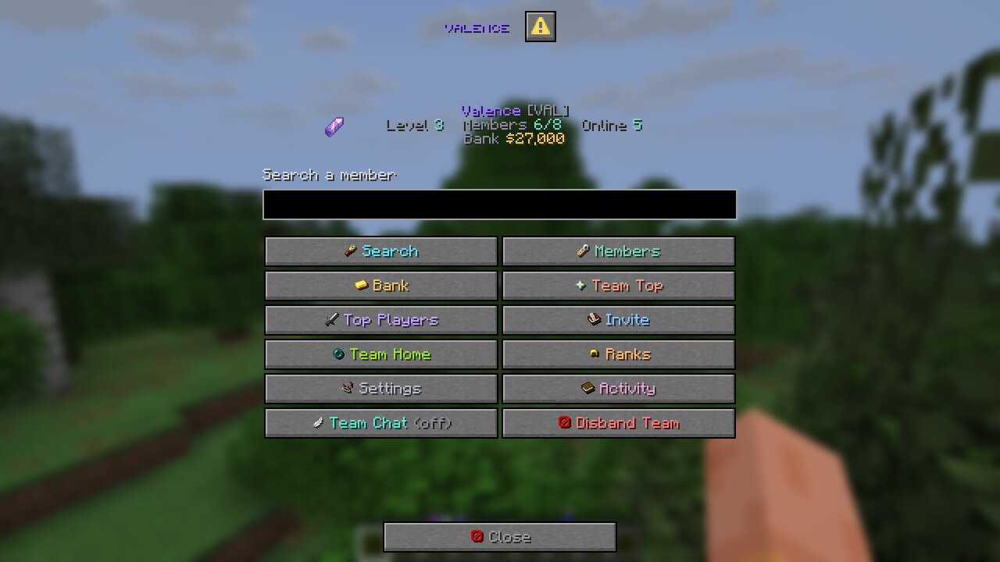

## Supported servers

| Server | Versions | Menus |
| --- | --- | --- |
| Paper | 1.21.7 – 26.3 | Dialog menus |
| Folia | 1.21.8 – 26.2 | Dialog menus |
| Paper / Folia | 1.21 – 1.21.6 | Chat menus (these versions have no dialog screens) |

On 1.21 – 1.21.6, every feature still works through commands and clickable chat. The small item icons inside buttons need 1.21.9 or newer; on 1.21.7 – 1.21.8 the buttons show text only.

**Optional:** [Vault](https://github.com/MilkBowl/Vault) (or [VaultUnlocked](https://modrinth.com/plugin/vaultunlocked) on Folia) with any economy plugin for the team bank, and [PlaceholderAPI](https://placeholderapi.com).

## Performance

Menus are built off the main thread, and so are most commands, the join message and team chat. Balances and playtime are cached, and team files save in the background. Only money changes and teleports run on the server thread.

In a 95 second stress test, 10 players opened 4,516 menus (about 48 per second) while also using team chat and commands. A profiler caught Valence on the main thread once in 535 samples, which works out to roughly 0.01% under that load. Normal play is far lighter.

## Features

- **Team creation in a form.** Name, tag, color and icon, all picked in one dialog. You can also use `/team create <name> [tag]`.
- **Main page.** Shows the team icon, level, member count and bank, plus a search bar that finds any member of your team.
- **Members list.** Click anyone to open their profile: their head icon, rank, balance, playtime, join date, kills, deaths and how much they have deposited.
- **Member management.** Promote, demote, set rank, send a private message, kick, or make someone the owner. The buttons only show what your rank is allowed to do.
- **Custom ranks.** The owner can make up to 10 ranks. Each rank has a name, an icon, a position in the ranking table and its own permissions (invite, kick, promote and demote, deposit, level up, set home, use home, edit settings).
- **Team bank.** Anyone with permission can deposit. Only the owner can withdraw or give money to a player. Amounts like `5k`, `2.5m` and `1,000` all work.
- **Team levels.** Spend bank money to level up. Higher levels allow more members.
- **Team Top.** A leaderboard of the richest teams.
- **Top Players.** The leaderboard inside your own team: most kills, richest members and top contributors.
- **Team home.** Unlocks at a configurable level. It has a warmup that cancels if you move, plus a cooldown.
- **Team chat.** Toggle it with `/team chat`, or send one message with `/tc <message>`.
- **Invites.** Invites pop up as a dialog with Accept and Deny buttons, plus clickable chat buttons, and they expire.
- **Open teams.** Teams can let anyone join. Players without a team can browse them.
- **Activity log.** Joins, leaves, kicks, promotions, deposits and settings changes.
- **Friendly fire toggle.** Blocks melee, arrows and tamed pets.
- **Small caps chat.** Every chat reply looks like ᴛʜɪꜱ. Commands and player names keep the normal font.

## Commands

| Command | What it does |
| --- | --- |
| `/team` | Open the team menu |
| `/team create <name> [tag]` | Create a team |
| `/team invite <player>` | Invite a player |
| `/team accept [team]` / `/team deny [team]` | Answer an invite |
| `/team join <team>` | Join an open team |
| `/team leave` | Leave your team |
| `/team disband confirm` | Delete your team (owner) |
| `/team kick / promote / demote <player>` | Manage members |
| `/team setrank <player> <rank>` | Set a member's rank |
| `/team transfer <player>` | Give the team to someone else |
| `/team members` / `bank` / `top` | Open a page directly |
| `/team info [team]` | Team info in chat |
| `/team deposit <amount>` / `withdraw <amount>` | Use the bank |
| `/team give <player> <amount>` | Pay someone from the bank (owner) |
| `/team upgrade` | Level up the team |
| `/team home` / `sethome` | Team home |
| `/team chat [message]` / `/tc [message]` | Team chat |
| `/team reload` | Reload config and messages (admin) |
| `/team admin disband <team>` | Delete any team (admin) |

Aliases: `/teams`, `/party`, `/t`.

## Permissions

| Permission | Default |
| --- | --- |
| `valence.use` | everyone |
| `valence.create` | everyone |
| `valence.admin` | op |

## Placeholders

`%valence_team_name%`, `%valence_team_tag%`, `%valence_team_color%`, `%valence_team_level%`, `%valence_team_bank%`, `%valence_team_members%`, `%valence_team_max_members%`, `%valence_team_online%`, `%valence_team_owner%`, `%valence_rank%`, `%valence_kills%`, `%valence_deaths%`, `%valence_has_team%`

Team Top: `%valence_top_<1-10>_name%`, `_tag`, `_bank`, `_level`

## Screenshots

These are real screenshots from a Minecraft 1.21.11 client.

| | |
| --- | --- |
| 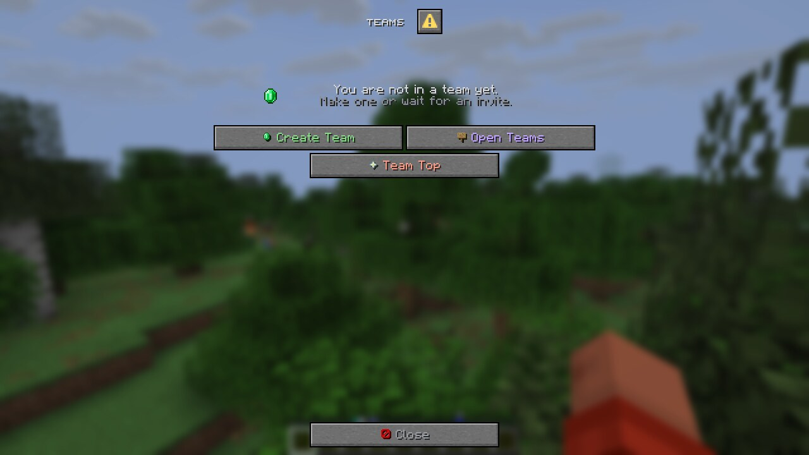 | 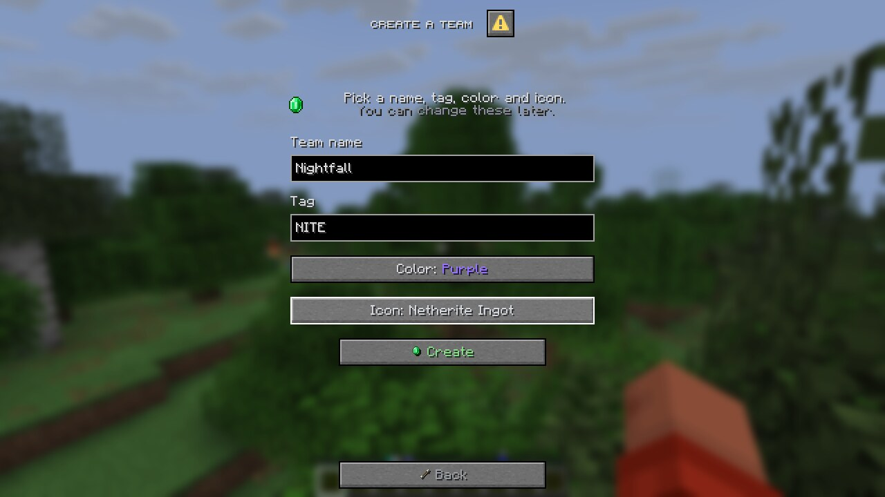 |
| 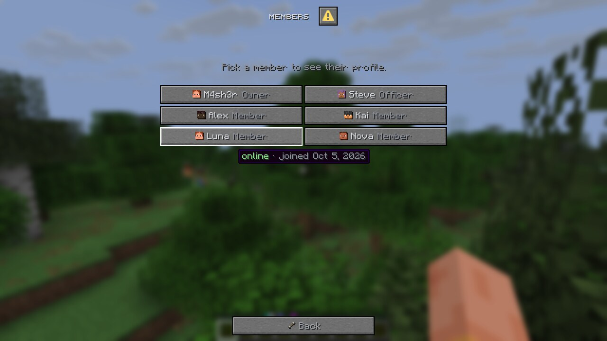 | 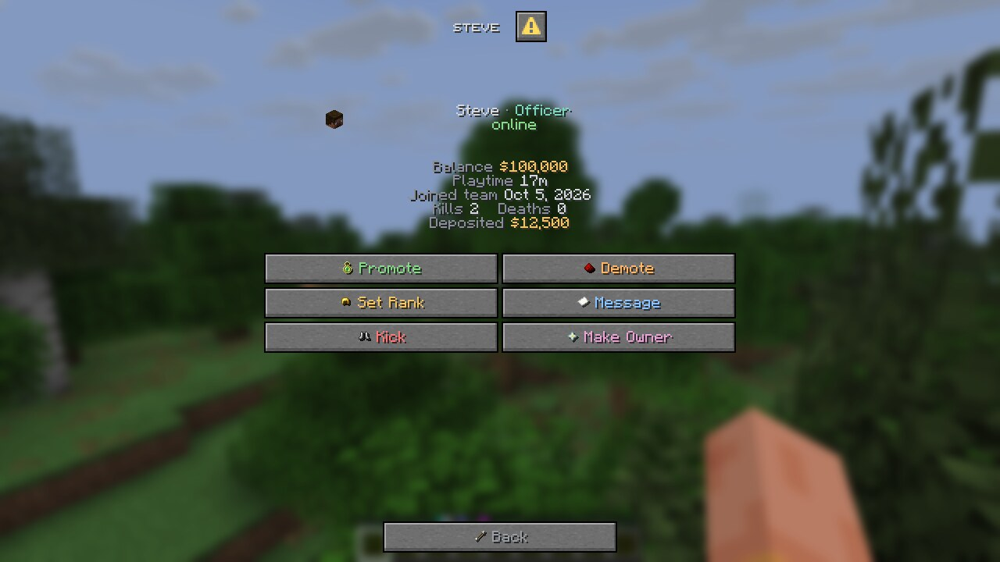 |
| 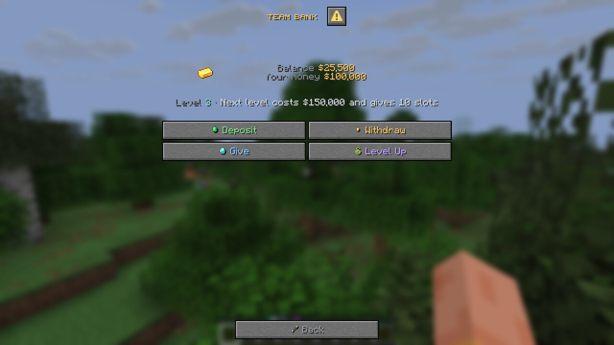 | 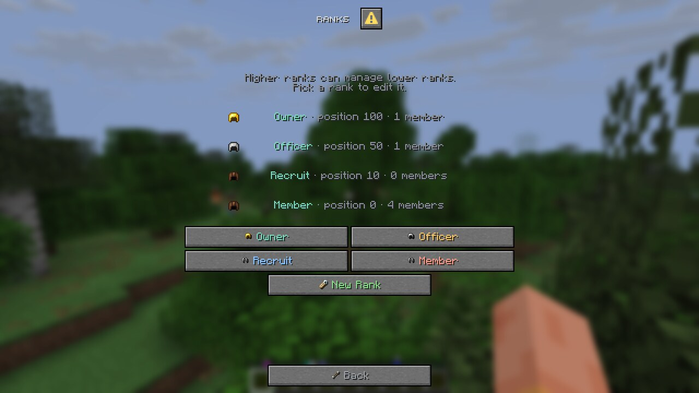 |
| 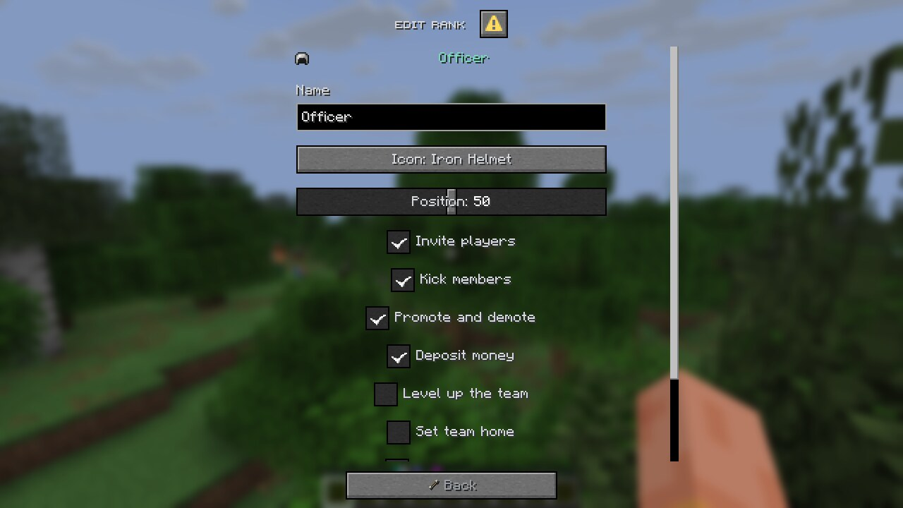 | 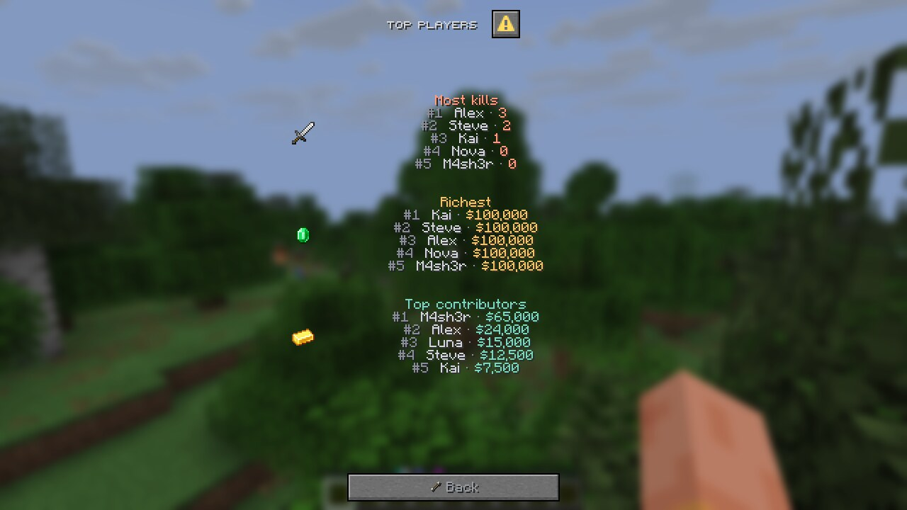 |
| 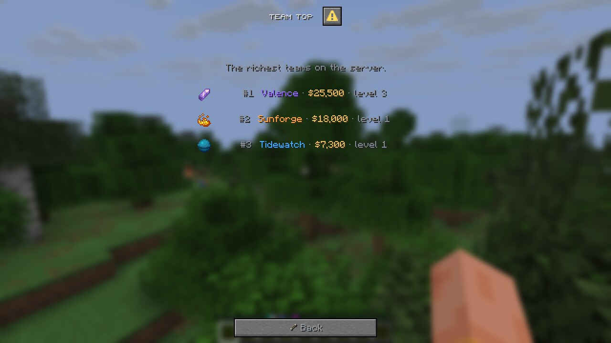 | 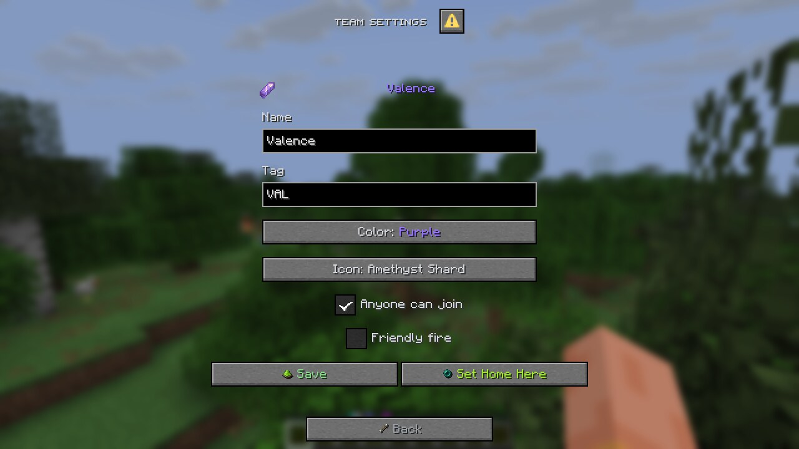 |
| 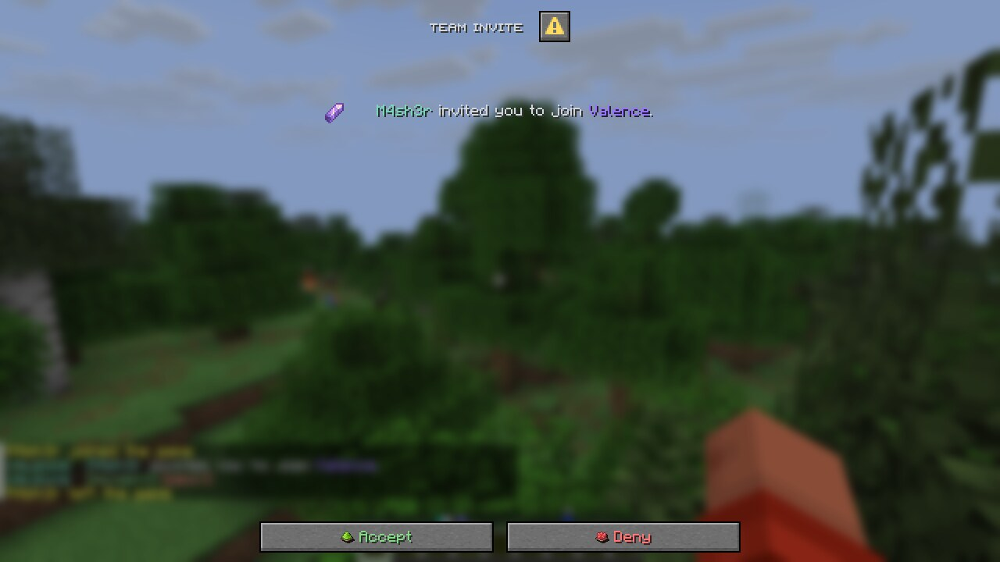 | 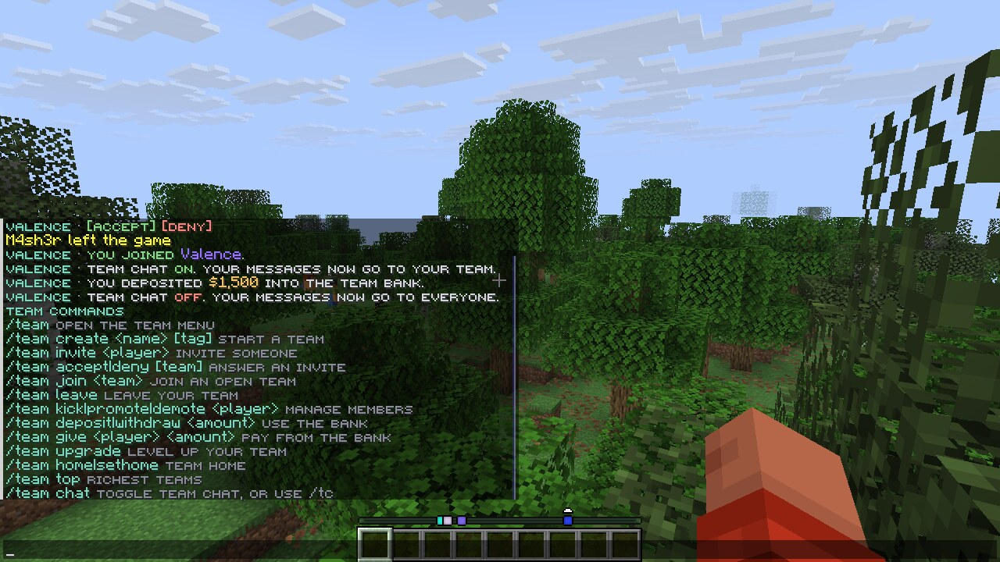 |

## Files

- `config.yml` holds team rules, levels, bank, home, chat, colors and icons.
- `messages.yml` holds every chat message and menu label. The `palette` section sets the main colors, every button has its own color, and `<icon:item_name>` puts an item picture in any label.
- `teams/` has one file per team. Saves happen in the background every few minutes and on shutdown.

## Building

```
mvn package
```

The jar ends up in `target/Valence-1.0.0.jar`. It needs Java 21.
